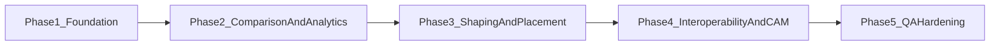

# Top 10 Feature Phased Development Plan

This roadmap phases your selected top 10 features into the current codebase in a way that minimizes rework and keeps each release shippable.

## In-Scope Features (Your Final Top 10)

1. Board Comparison Mode (Ghost Overlays + Delta Metrics)
2. Advanced Rail Design & Analysis Toolkit
3. Volume & Buoyancy Analytics Panel
4. Auto-Scaling Wizard with Constraint Locks
5. Plug/Fin-Box Placement & Alignment Module
6. 3D Curvature & Contour Heatmaps
7. Comprehensive 2D/3D Export Suite (DXF, PDF, STEP, IGES)
8. CAM Toolpath Preview & G-Code Post-Processing
9. Persistent Project Library & Version History
10. Shaper Workflow QA Checks (Rule-Based Validation)

## Current Architecture Anchors

- UI orchestration and workflow state: `apps/boardcad-desktop/src/App.tsx`
- Editing panels and controls: `apps/boardcad-desktop/src/components/AppSidebar.tsx`
- Interaction model: `apps/boardcad-desktop/src/hooks/useBoardCanvasEditing.ts`
- Core board model and geometry: `packages/boardcad-core/src/model/*`
- Undo/redo command architecture: `packages/boardcad-core/src/commands/boardCommands.ts`
- Existing loaders/export stubs: `packages/boardcad-core/src/loaders/index.ts`, `packages/boardcad-core/src/export/index.ts`
- Existing CAM groundwork: `packages/boardcad-core/src/cam/index.ts`
- Current file persistence path: `apps/boardcad-desktop/src/lib/fileIo.ts`

## Delivery Model

- 5 phases, each releasable.
- Foundations first (data model + persistence + geometry services).
- Production-heavy features (CAD/CAM) after analytics and validation baselines exist.

## Phase 1 - Foundation and Persistence

Primary goals:
- Build the backbone needed by most advanced features.

Features delivered:
- #9 Persistent Project Library & Version History
- #4 Auto-Scaling Wizard with Constraint Locks (first production version)

Implementation plan:
- Add a project metadata layer with schema versioning (project ID, board IDs, tags, rider/date/wave metadata, milestone snapshots).
- Add snapshot system (manual savepoints first, optional autosnapshot later).
- Refactor file IO adapter to support durable local storage + recent project index.
- Implement autoscaling engine in core with constraint locking strategies:
  - lock dimensions (nose/tail width, thickness points)
  - lock rocker anchors
  - preserve selected curve regions
- Wrap scaling operations as command objects so undo/redo remains consistent.

Codebase targets:
- `apps/boardcad-desktop/src/lib/fileIo.ts`
- `packages/boardcad-core/src/settings/*`
- `packages/boardcad-core/src/commands/boardCommands.ts`
- New: `packages/boardcad-core/src/analysis/scaling/*`
- New: `apps/boardcad-desktop/src/components/ProjectLibrary*`

Exit criteria:
- Projects open/save reliably with metadata and snapshots.
- Autoscale with locks is deterministic and undo-safe.
- Migration-safe schema version marker exists.

## Phase 2 - Comparison and Analytics

Primary goals:
- Give shapers insight tools for iterative design decisions.

Features delivered:
- #1 Board Comparison Mode
- #3 Volume & Buoyancy Analytics Panel

Implementation plan:
- Add dual-board compare context in app state (active board + reference board).
- Extend rendering pipeline for ghost overlays in plan/profile/section + 3D reference wireframe option.
- Build delta metrics service:
  - rocker delta curve
  - width/thickness deltas at stations
  - total volume delta
- Implement buoyancy analytics:
  - center of buoyancy estimate
  - slice-by-slice volume distribution visualization
  - station table export-ready data model

Codebase targets:
- `apps/boardcad-desktop/src/App.tsx`
- `apps/boardcad-desktop/src/canvas2d/*`
- `apps/boardcad-desktop/src/board3d/BoardScene3D.tsx`
- New: `packages/boardcad-core/src/analysis/metrics/*`
- New: `apps/boardcad-desktop/src/components/ComparisonPanel.tsx`
- New: `apps/boardcad-desktop/src/components/AnalyticsPanel.tsx`

Exit criteria:
- A/B compare can be toggled instantly.
- Deltas and volume analytics are stable across template set.
- Metrics are covered by regression tests.

## Phase 3 - Shaping and Placement Intelligence

Primary goals:
- Add high-value shaping control surfaces and hardware placement workflows.

Features delivered:
- #2 Advanced Rail Design & Analysis Toolkit
- #5 Plug/Fin-Box Placement & Alignment Module
- #6 3D Curvature & Contour Heatmaps

Implementation plan:
- Add rail parameter model (apex line, tuck depth, transition controls) and editable per-station tools.
- Add rail-specific section visualization panel with continuity diagnostics.
- Add plug/fin module with templates (FCS II, Futures as initial systems), mirroring, toe-in/cant presets, collision checks.
- Add curvature analysis pass in 3D:
  - curvature scalar map
  - contour/fairness display mode
  - user-adjustable thresholds for hotspot detection

Codebase targets:
- `apps/boardcad-desktop/src/components/AppSidebar.tsx`
- `apps/boardcad-desktop/src/board3d/BoardScene3D.tsx`
- New: `packages/boardcad-core/src/analysis/curvature/*`
- New: `packages/boardcad-core/src/design/rails/*`
- New: `packages/boardcad-core/src/design/finPlacement/*`
- New: `apps/boardcad-desktop/src/components/RailToolkitPanel.tsx`
- New: `apps/boardcad-desktop/src/components/FinPlacementPanel.tsx`

Exit criteria:
- Rail edits preserve smoothness/continuity within defined tolerances.
- Fin placement is template-driven, mirrored, and exportable as reference geometry.
- Heatmaps identify deliberate fairness perturbations in test boards.

## Phase 4 - Interoperability and Manufacturing Pipeline

Primary goals:
- Remove walled-garden risk and unlock pro manufacturing flow.

Features delivered:
- #7 Comprehensive 2D/3D Export Suite (DXF, PDF, STEP, IGES)
- #8 CAM Toolpath Preview & G-Code Post-Processing

Implementation plan:
- Complete export abstraction currently stubbed in core:
  - DXF 2D templates (outline/profile/sections)
  - PDF production sheets
  - STEP/IGES 3D surfaces/solids
- Introduce export profile presets (hand-shaping, CNC vendor, print package).
- Build CAM preview:
  - path simulation viewport
  - rapid/cut pass visualization
  - clearance and boundary checks
- Build post-processor framework:
  - machine profiles
  - axis conventions
  - pluggable G-code formatter strategies

Codebase targets:
- `packages/boardcad-core/src/export/index.ts`
- `packages/boardcad-core/src/print/index.ts`
- `packages/boardcad-core/src/cam/index.ts`
- New: `packages/boardcad-core/src/export/dxf/*`
- New: `packages/boardcad-core/src/export/stepIges/*`
- New: `apps/boardcad-desktop/src/components/CamPreviewPanel.tsx`
- New: `apps/boardcad-desktop/src/components/ExportProfilesPanel.tsx`

Exit criteria:
- All listed export formats generate valid files from standard/fish/longboard templates.
- CAM preview catches out-of-bounds and obvious crash conditions.
- Post-processors produce machine-specific output from one canonical path model.

## Phase 5 - Rule-Based QA and Release Hardening

Primary goals:
- Add intelligent guardrails and lock in reliability across the new feature surface.

Features delivered:
- #10 Shaper Workflow QA Checks
- End-to-end hardening across phases 1-4

Implementation plan:
- Build QA rule engine:
  - geometric continuity checks (kinks/flat spots)
  - thickness/stringer constraints
  - tooling clearance constraints for CAM
  - export readiness checks
- Add severity model (info/warn/blocking) with actionable fix hints.
- Integrate QA checks in sidebar + pre-export + pre-toolpath generation.
- Expand test matrix:
  - golden geometry tests
  - export validity tests
  - scenario tests (scale -> compare -> rail tune -> fin place -> export -> CAM preview)

Codebase targets:
- New: `packages/boardcad-core/src/qa/rules/*`
- New: `packages/boardcad-core/src/qa/engine.ts`
- `apps/boardcad-desktop/src/components/AppSidebar.tsx`
- `apps/boardcad-desktop/src/App.tsx`

Exit criteria:
- QA engine prevents known bad manufacturing outputs.
- Fix guidance is visible and understandable to non-technical shapers.
- Full regression suite passes with stable CI runtime.

## Dependency Order (Why This Sequence Works)

- Project/version infrastructure (#9) is prerequisite for reliable compare workflows and professional iteration.
- Analytics (#3) and comparison (#1) should precede advanced rail/heatmap tuning so users can quantify outcomes.
- Rail/placement/curvature (#2/#5/#6) should mature before final CAD/CAM delivery to avoid repeated exporter changes.
- QA checks (#10) are best after all major geometry/manufacturing features exist, then enforced across full pipeline.

## Suggested Release Labels

- `v0.2` -> Phase 1
- `v0.3` -> Phase 2
- `v0.4` -> Phase 3
- `v0.5` -> Phase 4
- `v1.0` -> Phase 5 (production confidence gate)

## Staffing and Execution Notes

- Recommended parallel tracks each phase:
  - Core geometry/analysis track (`packages/boardcad-core`)
  - UX/workflow track (`apps/boardcad-desktop`)
  - Validation/CI track (tests + fixture boards + export verifiers)
- Every new mutating tool should be command-backed for undo/redo compatibility.
- Keep feature flags per major module to allow staged rollouts and feedback.

